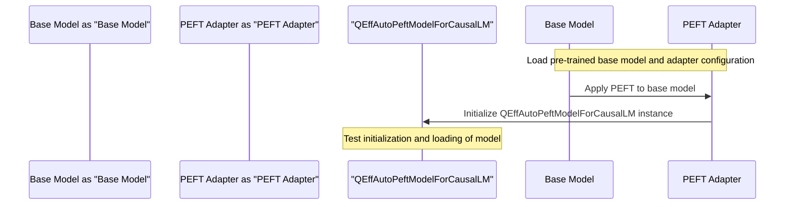

# PEFT Model Testing
## Overview
PEFT (Parameter-Efficient Fine-Tuning) model testing is a crucial step in ensuring the reliability and performance of PEFT models. This section provides an overview of the testing process, key components, and concepts involved in PEFT model testing.

## Key Components / Concepts
The key components involved in PEFT model testing include:
* `apply_peft` function: applies PEFT to a given Huggingface model if enabled in the training configuration.
* `test_auto_peft_model_for_causal_lm_from_pretrained` function: tests the AutoPEFT model for causal language models by loading a pre-trained base model, adapting it with a PEFT adapter, and then loading the adapted model into a QEffAutoPeftModelForCausalLM instance.
* `test_auto_peft_model_for_causal_lm_init` function: tests the initialization of the QEffAutoPeftModelForCausalLM class with different types of models for causal language models.

## How it Works
The testing process involves the following steps:
1. Load a pre-trained base model and adapter configuration.
2. Apply PEFT to the base model using the `apply_peft` function.
3. Initialize a QEffAutoPeftModelForCausalLM instance with the adapted model.
4. Test the initialization and loading of the model from pre-trained weights.

## Example(s)
An example of testing a PEFT model can be seen in the `test_auto_peft_model_for_causal_lm_from_pretrained` function:
```python
def test_auto_peft_model_for_causal_lm_from_pretrained(base_config, adapter_config, tmp_path):
    # Load pre-trained base model and adapter configuration
    base_model = AutoModelForCausalLM.from_config(base_config)
    # Apply PEFT to the base model
    lora_model = get_peft_model(base_model, adapter_config)
    # Initialize QEffAutoPeftModelForCausalLM instance
    qeff_model = QEffAutoPeftModelForCausalLM(lora_model)
    # Test the initialization and loading of the model
    assert set(qeff_model.adapter_weights.keys()) == {adapter_config.adapter_name}
```

## Diagram(s)

Caption: Sequence diagram of PEFT model testing process

## References
* `tests/peft/test_peft_model.py`
* `tests/transformers/models/test_causal_lm_models.py`
* `QEfficient/transformers/models/llava_next/modeling_llava_next.py`
* `tests/base/test_export_memory_offload.py`