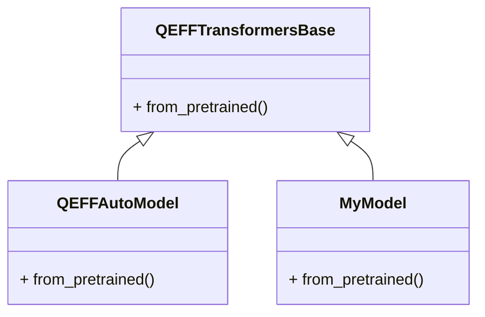

# Adding New Model Support
## Overview
The QEfficient framework provides a unified interface for integrating various transformer models from the HuggingFace hub. To add new model support, users can leverage the `QEFFTransformersBase` class, which serves as a base class for QEfficient wrappers around HuggingFace transformer models. This class provides common functionality for loading, representing, and managing HuggingFace models within the QEfficient framework.

## Key Components / Concepts
The key components involved in adding new model support include:
* `QEFFTransformersBase`: The base class for QEfficient wrappers around HuggingFace transformer models.
* `QEFFAutoModel`: A class that provides a unified interface for loading, exporting, compiling, and running various encoder-only transformer models on Cloud AI 100 hardware.
* `from_pretrained`: A method that loads a QEfficient transformer model from a pretrained HuggingFace model or local path, initializing it with the pretrained weights.

## How it Works
To add new model support, users can follow these steps:
1. Create a new class that inherits from `QEFFTransformersBase`.
2. Implement the `from_pretrained` method to load the new model from a pretrained HuggingFace model or local path.
3. Configure the model settings, such as attention implementation and memory usage, to ensure compatibility.
4. Use the `QEFFAutoModel` class to provide a unified interface for loading, exporting, compiling, and running the new model.

## Example(s)
For example, to add support for a new transformer model called "MyModel", users can create a new class `MyModel` that inherits from `QEFFTransformersBase`:
```python
class MyModel(QEFFTransformersBase):
    def __init__(self, model: nn.Module, **kwargs) -> None:
        super().__init__(model, **kwargs)

    @classmethod
    def from_pretrained(cls, pretrained_model_name_or_path: str, *args, **kwargs):
        # Load the pretrained model from HuggingFace or local path
        model = AutoModel.from_pretrained(pretrained_model_name_or_path, *args, **kwargs)
        return cls(model)
```
## Diagram(s)

This diagram shows the class hierarchy and relationships between `QEFFTransformersBase`, `QEFFAutoModel`, and `MyModel`.

## References
* `QEfficient/transformers/models/modeling_auto.py`: This file provides the implementation of the `QEFFTransformersBase` and `QEFFAutoModel` classes.
* `QEfficient/transformers/models/modeling_gemma2.py`: This file provides an example of how to add support for a new transformer model, in this case, the Gemma2 model.
* `QEfficient/base/modeling_qeff.py`: This file provides the base class for various model classes, including LLMs, SD, and quantized models.
* `docs/source/quick_start.md`: This file provides an overview of the QEfficient library and its usage.