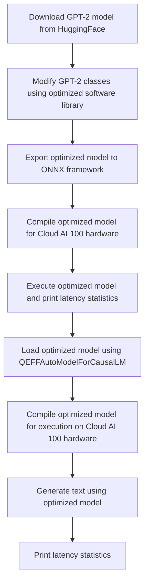

# QEfficientGPT2 Notebook
## Overview
The QEfficientGPT2 Notebook is a comprehensive demonstration of the optimization and inference of the GPT-2 model using the Efficient Transformers workflow. This notebook showcases the onboarding of the GPT-2 model on the Cloud AI 100 platform, optimizing it for better performance. The model is downloaded from HuggingFace and modified using an optimized software library to generate a model for Cloud AI 100, with optimizations such as RMS Norm Fixes and KV Cache retention changes. The primary goal of this notebook is to provide a step-by-step guide on how to optimize and deploy the GPT-2 model on the Cloud AI 100 platform, leveraging the Efficient Transformers workflow.

The QEfficientGPT2 Notebook is designed to be a self-contained example, providing a clear understanding of the optimization and inference process. It covers the entire workflow, from downloading the pre-trained GPT-2 model to compiling and executing the optimized model on the Cloud AI 100 hardware. The notebook also includes examples of how to use the optimized model for text generation, making it a valuable resource for developers and researchers working with large language models.

## Key Components / Concepts
The key components of the QEfficientGPT2 Notebook include:
* The `QEfficientGPT2.ipynb` file, which demonstrates the onboarding of the GPT-2 model on the Cloud AI 100 platform. This file contains the complete code for optimizing and inferring the GPT-2 model, including the download and modification of the model, export to ONNX, compilation, and execution.
* The `QEFFAutoModelForCausalLM` class, which provides a unified interface for loading, exporting, compiling, and generating text with causal language models on Cloud AI 100 hardware. This class is a crucial component of the Efficient Transformers workflow, enabling the optimization and deployment of large language models on the Cloud AI 100 platform.
* The `from_pretrained` function, which loads a QEfficient transformer model from a pretrained HuggingFace model or local path. This function allows users to easily load pre-trained models and modify them for deployment on the Cloud AI 100 platform.

In addition to these key components, the QEfficientGPT2 Notebook also utilizes several other important concepts, including:
* The Efficient Transformers workflow, which provides a standardized approach to optimizing and deploying large language models on the Cloud AI 100 platform.
* The ONNX framework, which enables the export and compilation of optimized models for execution on the Cloud AI 100 hardware.
* The Cloud AI 100 platform, which provides a high-performance environment for deploying and executing optimized models.

## How it Works
The QEfficientGPT2 Notebook works by:
1. Downloading the GPT-2 model from HuggingFace and saving it in a local cache directory. This step retrieves the pre-trained GPT-2 model, which is then modified and optimized for deployment on the Cloud AI 100 platform.
2. Modifying the GPT-2 classes using the optimized software library to generate a model for Cloud AI 100. This step involves applying optimizations such as RMS Norm Fixes and KV Cache retention changes to the GPT-2 model, enabling it to run efficiently on the Cloud AI 100 hardware.
3. Exporting the optimized model to the ONNX framework and compiling it for execution on the Cloud AI 100 hardware. This step converts the optimized model into a format that can be executed on the Cloud AI 100 platform, leveraging the ONNX framework for model export and compilation.
4. Executing the optimized model and printing latency statistics. This step runs the optimized model on the Cloud AI 100 hardware, measuring and reporting the latency of the model to ensure that it meets the required performance standards.

The QEfficientGPT2 Notebook also includes several additional steps, including:
* Loading the optimized model using the `QEFFAutoModelForCausalLM` class and compiling it for execution on the Cloud AI 100 hardware.
* Generating text using the optimized model, demonstrating its capabilities and performance.
* Printing latency statistics, providing insights into the performance of the optimized model.

## Example(s)
An example of using the QEfficientGPT2 Notebook is:
```python
from QEfficient import QEFFAutoModelForCausalLM
model = QEFFAutoModelForCausalLM.from_pretrained("gpt2")
model.compile(num_cores=16)
tokenizer = AutoTokenizer.from_pretrained("gpt2")
model.generate(prompts=["Hi there!!"], tokenizer=tokenizer)
```
This example loads the GPT-2 model, compiles it for execution on 16 cores, and generates text based on the prompt "Hi there!!". The `from_pretrained` function is used to load the pre-trained GPT-2 model, which is then compiled and executed using the `QEFFAutoModelForCausalLM` class.

Additional examples can be found in the `QEfficientGPT2.ipynb` file, which includes a range of demonstrations and experiments showcasing the capabilities and performance of the optimized GPT-2 model.

## Diagram(s)

This flowchart illustrates the steps involved in optimizing and inferring the GPT-2 model using the Efficient Transformers workflow. The diagram provides a clear overview of the process, from downloading the pre-trained GPT-2 model to generating text using the optimized model.

## References
* `notebooks/QEfficientGPT2.ipynb`: The QEfficientGPT2 Notebook file, which demonstrates the onboarding of the GPT-2 model on the Cloud AI 100 platform.
* `QEfficient/transformers/models/modeling_auto.py`: The file containing the `QEFFAutoModelForCausalLM` class, which provides a unified interface for loading, exporting, compiling, and generating text with causal language models on Cloud AI 100 hardware.
* `docs/source/quick_start.md`: The Quick Start guide for the QEfficient Library, which provides an overview of the library and its usage.
* `pyproject.toml`: The project file for the QEfficient Library, which specifies the dependencies and configuration for the library.
* `docs/source/introduction.md`: The introduction to the Qualcomm "efficient-transformers" library, which provides an overview of the library and its purpose.