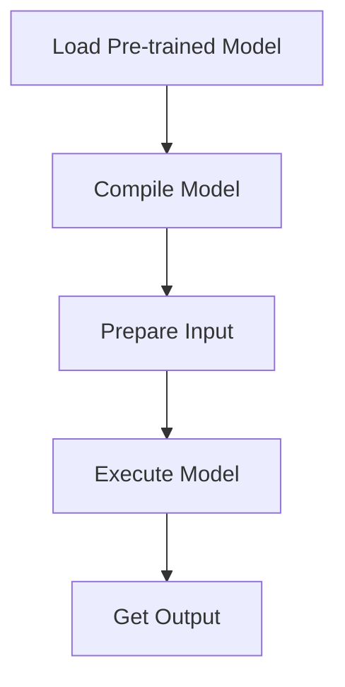

# Model-Specific Examples
## Overview
This section provides examples of using specific models with QEfficient, a library that enables efficient deployment of transformer-based models. The library leverages the Hugging Face hub for model access and manipulation.

## Key Components / Concepts
The key components of QEfficient include the `QEFFAutoModel` class, which manipulates transformer models from the Hugging Face hub, and the `QEffPeftModelForCausalLM` class, used for causal language models. These classes facilitate model loading, compilation, and execution.

## How it Works
To utilize QEfficient, import the necessary classes and models. Then, use the `from_pretrained` method to load a pre-trained model and compile it for QEfficient. This compilation step is crucial for optimizing model performance, especially when deploying on specific hardware like Cloud AI 100.

## Example(s)
Here is an example of using the `QEFFAutoModel` class:
```python
from QEfficient import QEFFAutoModel
from transformers import AutoTokenizer

# Initialize the model using from_pretrained
model = QEFFAutoModel.from_pretrained("model_name")

# Compile the model for Cloud AI 100
model.compile(num_cores=16)

# Prepare input
tokenizer = AutoTokenizer.from_pretrained("model_name")
inputs = tokenizer("My name is", return_tensors="pt")

# Execute the model
outputs = model.generate(inputs)
```

## Diagram(s)

Caption: Flowchart illustrating the QEfficient workflow from model loading to output generation.

## References
* `QEfficient/peft/__init__.py`
* `QEfficient/transformers/models/modeling_auto.py`
* `QEfficient/transformers/modeling_utils.py`
* `examples/draft_spd_inference.py`