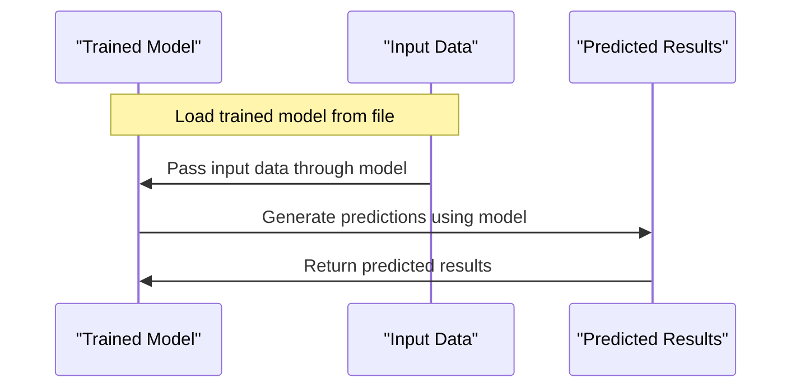

# Model Inference
## Overview
Model inference is the process of using a trained model to make predictions on new, unseen data. In the context of QEfficient, model inference can be performed using different models, including PyTorch, ONNX, and Cloud AI 100, which are supported by the `QEfficient/transformers/models` directory.

## Key Components / Concepts
The key components involved in model inference are:
* **Model**: The trained model used for inference, such as those defined in `QEfficient/transformers/models/llava_next/modeling_llava_next.py`.
* **Input data**: The new data used to make predictions, which can be prepared using functions like those in `tests/cloud/test_infer.py`.
* **Output**: The predicted results, which can be generated and returned using the `test_infer_qnn` function.

## How it Works
The model inference process works as follows:
1. Load the trained model from a file, such as those stored in the `QEfficient/transformers/models` directory.
2. Prepare the input data, which can involve preprocessing and formatting the data for the model.
3. Pass the input data through the model to generate predictions, using functions like those in `tests/transformers/models/test_causal_lm_models.py`.
4. Return the predicted results, which can be used for further analysis or decision-making.

## Example(s)
For example, the `test_infer_qnn` function tests the inference of a model in a QNN environment without using the full batch size, demonstrating how to use the model inference process in a specific context.

## Diagram(s)

Caption: Model Inference Sequence Diagram

## References
* `tests/cloud/test_infer.py`
* `tests/transformers/models/test_causal_lm_models.py`
* `QEfficient/transformers/models/llava_next/modeling_llava_next.py`