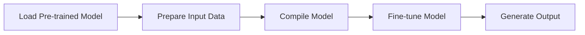

# Finetuning Models
## Overview
Finetuning models is a crucial aspect of the Efficient Transformers library, allowing users to adapt pre-trained models to their specific use cases. This guide provides an overview of the finetuning process and highlights key components and concepts.

## Key Components / Concepts
The Efficient Transformers library provides several key components and concepts that facilitate finetuning, including:
* `QEFFAutoModel`: a class designed for manipulating transformer models from the HuggingFace hub
* `from_pretrained`: a function used to load models supported by transformers.AutoModelForImageTextToText for Cloud AI 100
* `compile`: a method that compiles the model for Cloud AI 100

## How it Works
The finetuning process involves the following steps:
1. Load a pre-trained model using `from_pretrained`
2. Prepare the input data and configure the model settings
3. Compile the model for Cloud AI 100 using the `compile` method
4. Fine-tune the model on the target dataset

## Example(s)
```python
from QEfficient import QEFFAutoModel
from transformers import AutoTokenizer

# Load a pre-trained model
model = QEFFAutoModel.from_pretrained("model_name")

# Compile the model for Cloud AI 100
model.compile(num_cores=16)

# Prepare input data
tokenizer = AutoTokenizer.from_pretrained("model_name")
inputs = tokenizer("My name is", return_tensors="pt")

# Fine-tune the model
model.generate(inputs)
```

## Diagram(s)

Finetuning Process Flowchart

## References
* `QEfficient/transformers/models/modeling_auto.py`
* `tests/transformers/models/test_causal_lm_models.py`
* `QEfficient/utils/run_utils.py`
* `tests/transformers/test_speech_seq2seq.py`