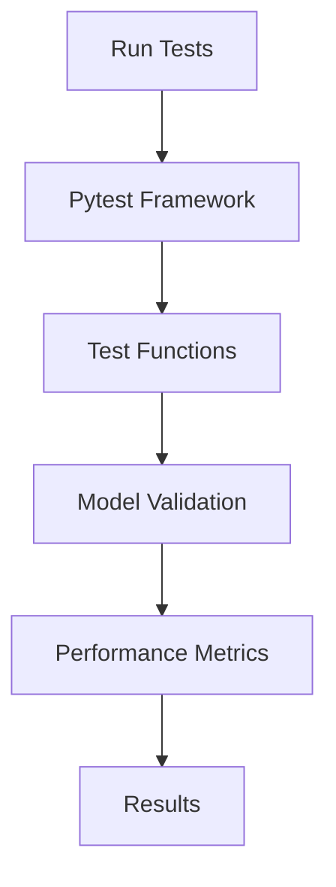

# Introduction to Tests
## Overview
The Efficient Transformers Wiki repository, located at `Efficient Transformers Wiki/`, contains a comprehensive set of tests to ensure the correctness and performance of the models and functions. These tests are designed to validate the behavior of the models under various conditions and scenarios, as outlined in [tests/README.md](tests/README.md).

## Key Components / Concepts
The tests in the repository cover a range of key components and concepts, including:
* Causal language modeling, implemented in [tests/transformers/models/test_causal_lm_models.py](tests/transformers/models/test_causal_lm_models.py)
* Sequence-to-sequence tasks
* Embedding models, tested in [tests/transformers/models/test_embedding_models.py](tests/transformers/models/test_embedding_models.py)
* Speculative decoding
* Continuous batching

## How it Works
The tests are implemented using the Pytest framework and can be run using the `pytest` command. The tests are organized into several files, each covering a specific aspect of the models or functions, such as [tests/cloud/test_infer.py](tests/cloud/test_infer.py) for cloud-based inference testing.

## Example(s)
For example, the `test_causal_lm_pytorch_vs_kv_vs_ort_vs_ai100` function tests the performance of four different models (PyTorch, PyTorch with KV changes, ONNX, and Cloud AI 100) on a causal language model task, with results comparable to those obtained in [tests/transformers/spd/test_pld_inference.py](tests/transformers/spd/test_pld_inference.py).

## Diagram(s)

Caption: Test Workflow Diagram

## References
* [tests/README.md](tests/README.md)
* [tests/transformers/models/test_causal_lm_models.py](tests/transformers/models/test_causal_lm_models.py)
* [tests/cloud/test_infer.py](tests/cloud/test_infer.py)
* [tests/transformers/models/test_embedding_models.py](tests/transformers/models/test_embedding_models.py)