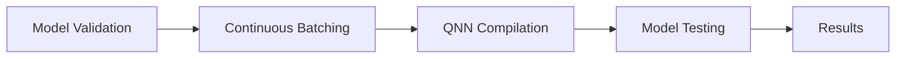

# Transformer Models Testing
## Overview
Transformer models testing is a crucial aspect of the Efficient Transformers Library, providing support for various transformer models, including Llama4, Gemma3, and HP-CAI Grok-1, among others. It enables efficient inference and compilation of these models, with features such as sentence embedding, flexible pooling configuration, and support for multiple sequence lengths.

## Key Components / Concepts
The key components of transformer models testing include:
* **Model Validation**: Validating the performance of different models, including PyTorch, PyTorch with KV changes, ONNX, and Cloud AI 100.
* **Continuous Batching**: Testing the models with and without continuous batching.
* **QNN Compilation**: Compiling the models using QNN (Quantization Neural Network) for improved performance.

## How it Works
The testing process involves calling various test functions, such as `test_causal_lm_pytorch_vs_kv_vs_ort_vs_ai100` and `test_seq2seq_pytorch_vs_kv_vs_ort_vs_ai100`, which validate the performance of the models. These functions take in various inputs, including the model name, batch size, prompt length, and number of layers.

## Example(s)
An example of a test function is `test_causal_lm_pytorch_vs_kv_vs_ort_vs_ai100`, which tests the performance of four models: PyTorch, PyTorch with KV changes, ONNX, and Cloud AI 100, on a causal language model task.

## Diagram(s)

Caption: Transformer Models Testing Flowchart

## References
* `tests/transformers/models/test_causal_lm_models.py`
* `tests/transformers/models/test_speech_seq2seq_models.py`
* `QEfficient/transformers/models/modeling_auto.py`
* `tests/transformers/test_transformer_pytorch_transforms.py`