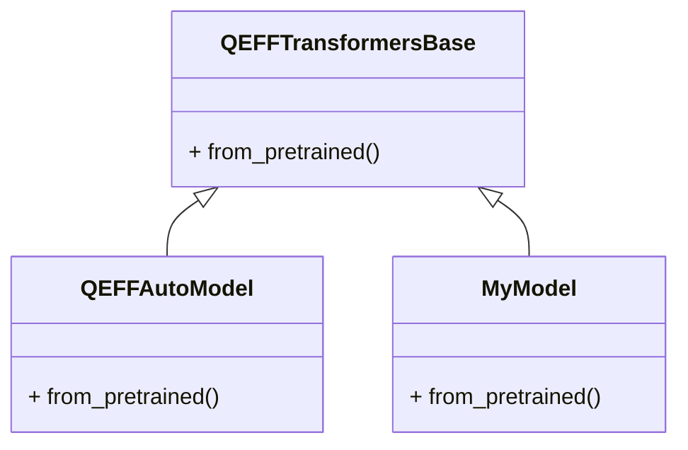

# Adding New Model Support
## Overview
The QEfficient framework provides a unified interface for integrating various transformer models from the HuggingFace hub. To add new model support, users can leverage the `QEFFTransformersBase` class, which serves as a base class for QEfficient wrappers around HuggingFace transformer models. This class provides common functionality for loading, representing, and managing HuggingFace models within the QEfficient framework. The `QEFFTransformersBase` class is designed to be extensible, allowing users to easily add support for new models by creating a new class that inherits from it.

The process of adding new model support involves several key steps, including creating a new class that inherits from `QEFFTransformersBase`, implementing the `from_pretrained` method to load the new model from a pretrained HuggingFace model or local path, configuring the model settings to ensure compatibility, and using the `QEFFAutoModel` class to provide a unified interface for loading, exporting, compiling, and running the new model. By following these steps, users can easily add support for new transformer models, making it possible to leverage the capabilities of the QEfficient framework with a wide range of models.

## Key Components / Concepts
The key components involved in adding new model support include:
* `QEFFTransformersBase`: The base class for QEfficient wrappers around HuggingFace transformer models. This class provides common functionality for loading, representing, and managing HuggingFace models within the QEfficient framework.
* `QEFFAutoModel`: A class that provides a unified interface for loading, exporting, compiling, and running various encoder-only transformer models on Cloud AI 100 hardware. This class is designed to work seamlessly with the `QEFFTransformersBase` class, making it easy to add support for new models.
* `from_pretrained`: A method that loads a QEfficient transformer model from a pretrained HuggingFace model or local path, initializing it with the pretrained weights. This method is a key part of the process of adding new model support, as it allows users to easily load and initialize new models.

In addition to these key components, there are several other important concepts to understand when adding new model support. These include:
* **Model configuration**: The process of configuring the model settings, such as attention implementation and memory usage, to ensure compatibility with the QEfficient framework.
* **Model loading**: The process of loading a pretrained HuggingFace model or local path, initializing it with the pretrained weights.
* **Model exporting**: The process of exporting a QEfficient transformer model to a format that can be used with the Cloud AI 100 hardware.

## How it Works
To add new model support, users can follow these steps:
1. Create a new class that inherits from `QEFFTransformersBase`. This class should provide the necessary functionality for loading, representing, and managing the new model.
2. Implement the `from_pretrained` method to load the new model from a pretrained HuggingFace model or local path. This method should initialize the new model with the pretrained weights.
3. Configure the model settings, such as attention implementation and memory usage, to ensure compatibility with the QEfficient framework.
4. Use the `QEFFAutoModel` class to provide a unified interface for loading, exporting, compiling, and running the new model.

By following these steps, users can easily add support for new transformer models, making it possible to leverage the capabilities of the QEfficient framework with a wide range of models.

## Example(s)
For example, to add support for a new transformer model called "MyModel", users can create a new class `MyModel` that inherits from `QEFFTransformersBase`:
```python
class MyModel(QEFFTransformersBase):
    def __init__(self, model: nn.Module, **kwargs) -> None:
        super().__init__(model, **kwargs)

    @classmethod
    def from_pretrained(cls, pretrained_model_name_or_path: str, *args, **kwargs):
        # Load the pretrained model from HuggingFace or local path
        model = AutoModel.from_pretrained(pretrained_model_name_or_path, *args, **kwargs)
        return cls(model)
```
This example illustrates the process of creating a new class that inherits from `QEFFTransformersBase` and implementing the `from_pretrained` method to load the new model from a pretrained HuggingFace model or local path.

In addition to this example, there are several other examples of how to add support for new transformer models in the QEfficient framework. These include:
* **Gemma2 model**: The Gemma2 model is an example of a transformer model that has been added to the QEfficient framework. The implementation of the Gemma2 model can be found in the `QEfficient/transformers/models/modeling_gemma2.py` file.
* **LLM model**: The LLM model is another example of a transformer model that has been added to the QEfficient framework. The implementation of the LLM model can be found in the `QEfficient/base/modeling_qeff.py` file.

## Diagram(s)

This diagram shows the class hierarchy and relationships between `QEFFTransformersBase`, `QEFFAutoModel`, and `MyModel`. The `QEFFTransformersBase` class is the base class for QEfficient wrappers around HuggingFace transformer models, while the `QEFFAutoModel` class provides a unified interface for loading, exporting, compiling, and running various encoder-only transformer models on Cloud AI 100 hardware. The `MyModel` class is an example of a new transformer model that has been added to the QEfficient framework.

In addition to this diagram, there are several other diagrams that illustrate the architecture and components of the QEfficient framework. These include:
* **Sequence diagram**: A sequence diagram that shows the sequence of events that occur when adding new model support to the QEfficient framework.
* **Component diagram**: A component diagram that shows the components and relationships between the components of the QEfficient framework.

## References
* `QEfficient/transformers/models/modeling_auto.py`: This file provides the implementation of the `QEFFTransformersBase` and `QEFFAutoModel` classes.
* `QEfficient/transformers/models/modeling_gemma2.py`: This file provides an example of how to add support for a new transformer model, in this case, the Gemma2 model.
* `QEfficient/base/modeling_qeff.py`: This file provides the base class for various model classes, including LLMs, SD, and quantized models.
* `docs/source/quick_start.md`: This file provides an overview of the QEfficient library and its usage.
* `QEfficient/transformers/models/modeling_qeff.py`: This file provides the implementation of the `QEFFTransformersBase` class and other related classes.