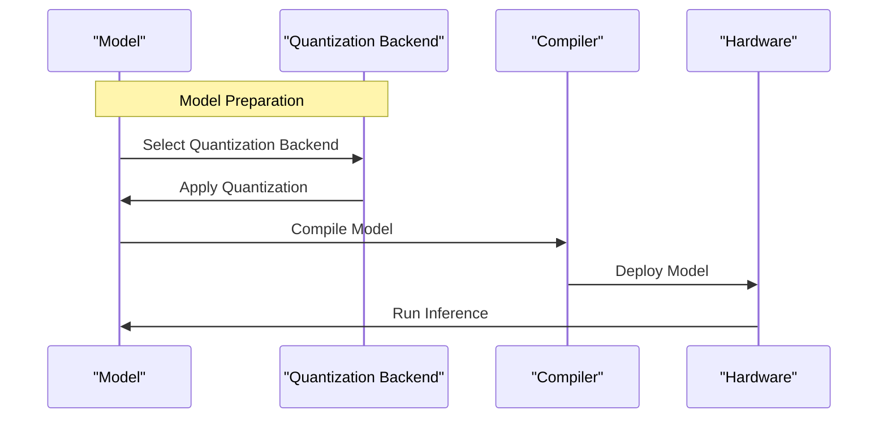

# Quantization Support
## Overview
Quantization is a critical component in optimizing deep learning models for efficient deployment on various hardware platforms. The QEfficient library provides built-in support for quantization through multiple back-ends, including AWQ (Adaptive Weight Quantization), GPTQ (Generalized Post-Training Quantization), and FP8 (8-bit Floating Point). This support enables users to apply quantization to their models, significantly reducing the memory footprint and computational requirements without substantial loss in model accuracy. Quantization is particularly useful for deploying models on edge devices or in environments where computational resources are limited. By reducing the precision of model weights and activations from 32-bit floating-point numbers to lower precision formats, quantization can lead to significant reductions in memory usage and energy consumption, making it an essential technique for real-world applications of deep learning models.

The QEfficient library's quantization support is designed to be flexible and user-friendly, allowing developers to easily integrate quantization into their model development workflow. With QEfficient, users can choose from a variety of quantization backends, each with its own strengths and weaknesses, to find the best approach for their specific use case. Whether you're working with computer vision models, natural language processing models, or other types of deep learning models, QEfficient's quantization support can help you achieve the efficiency and performance you need.

## Key Components / Concepts
- **AWQ (Adaptive Weight Quantization):** AWQ is a quantization technique that adapts the quantization scheme based on the model's weights, aiming to minimize the loss in accuracy due to quantization. AWQ is particularly useful for models with diverse weight distributions, as it can adapt to the specific characteristics of the model's weights. By doing so, AWQ can help maintain the model's accuracy while still achieving significant reductions in memory usage and computational intensity.
- **GPTQ (Generalized Post-Training Quantization):** GPTQ is a method designed for quantizing transformer models. It involves learning the optimal quantization points post-training to maintain model performance. GPTQ is particularly useful for transformer-based models, as it can take advantage of the model's architecture to find the most effective quantization points. By learning the optimal quantization points, GPTQ can help minimize the loss in accuracy due to quantization, resulting in a more efficient and accurate model.
- **FP8 (8-bit Floating Point):** FP8 is a floating-point format that uses 8 bits to represent numbers, offering a significant reduction in memory usage and computational intensity compared to the standard 32-bit floating-point format. FP8 is a relatively new format that has gained popularity in recent years due to its ability to provide a good balance between precision and efficiency. By using FP8, developers can achieve significant reductions in memory usage and energy consumption, making it an attractive option for a wide range of applications.

## How it Works
The quantization process in QEfficient involves several steps:
1. **Model Preparation:** The user selects a model to be quantized. This could be any transformer-based model supported by the Hugging Face ecosystem. The model is first loaded into memory, and its architecture is analyzed to determine the best quantization approach.
2. **Quantization Backend Selection:** The user chooses a quantization backend (AWQ, GPTQ, or FP8) based on their specific requirements and the characteristics of the model. The choice of quantization backend depends on various factors, including the model's architecture, the desired level of precision, and the target hardware platform.
3. **Quantization:** The selected quantization backend applies its quantization algorithm to the model. This involves converting the model's weights and, in some cases, activations to the chosen quantized format. The quantization process can be done using various techniques, including uniform quantization, non-uniform quantization, or learned quantization.
4. **Model Compilation:** After quantization, the model is compiled into an optimized form that can be executed efficiently on the target hardware. This step may involve additional optimizations such as knowledge distillation or pruning. The compiled model is then ready for deployment on the target hardware platform.
5. **Deployment:** The quantized and compiled model is then deployed on the target hardware, where it can be used for inference. The deployed model can be used for a variety of tasks, including classification, regression, and generation.

## Example(s)
To quantize a model using QEfficient, you might follow these steps:
```python
from QEfficient import QEFFAutoModel
from transformers import AutoTokenizer

# Load a pre-trained model and tokenizer
model = QEFFAutoModel.from_pretrained("sentence-transformers/all-MiniLM-L6-v2", pooling="mean")
tokenizer = AutoTokenizer.from_pretrained("sentence-transformers/all-MiniLM-L6-v2")

# Compile the model with quantization
model.compile(num_cores=16, quantization="awq")

# Prepare input
inputs = tokenizer("My name is", return_tensors="pt")

# Generate output
output = model.generate(inputs)
print(output)
```
This example demonstrates how to quantize a pre-trained model using the AWQ quantization backend. The `compile` method is used to quantize the model, and the `generate` method is used to generate output from the quantized model.

## Diagram(s)
```mermaid
flowchart LR
    A[Model Selection] -->|Choose Model|> B[Quantization Backend Selection]
    B -->|Select Quantization Method|> C[Quantization]
    C -->|Apply Quantization|> D[Model Compilation]
    D -->|Compile Model|> E[Deployment]
    E -->|Deploy Model|> F[Inference]
```
Caption: Overview of the Quantization Process in QEfficient.


Caption: Detailed Sequence Diagram of the Quantization Process in QEfficient.

## References
- `QEfficient/transformers/quantizers/gptq.py`
- `QEfficient/transformers/models/modeling_auto.py`
- `QEfficient/transformers/quantizers/auto.py`
- `QEfficient/transformers/optimization.py`
- `QEfficient/examples/quantization_example.py`