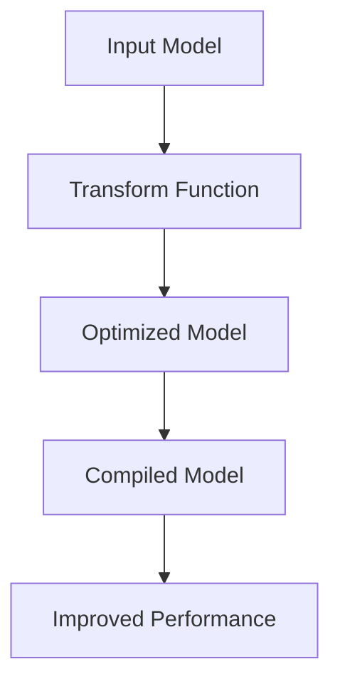

# Introduction to Efficient Transformers
## Overview
The Efficient Transformers library, located at `QEfficient/transformers`, is a collection of optimized transformer models that improve efficiency and support various features such as speculative decoding, finite adapters, and quantized models. The library takes in various input models, including Llama, Gemma, and Granite, and outputs compiled models with improved performance, as defined in `QEfficient/transformers/models/modeling_auto.py`.

## Key Components / Concepts
The library includes several key components, such as the `QEFFTransformersBase` class, which serves as the parent class for models provided by the library, and is implemented in `QEfficient/transformers/models/modeling_auto.py`. It also includes various model classes, such as `QEffGPT2Model`, `QEffGPTJModel`, and `QEffLlamaModel`, which are optimized versions of popular transformer models.

## How it Works
The library works by replacing the torch.nn.Module layers of the input model with optimized implementation of the same, as specified in `QEfficient/transformers/transform.py`. This is achieved through the `transform` function, which takes in a model and a form factor configuration, and returns the optimized model.

## Example(s)
An example of how to use the library can be found in the `README.md` file, which provides a step-by-step guide on how to get started with the library. The example demonstrates how to utilize the `QEfficient/transformers/transform.py` function to optimize a model.

## Diagram(s)

Caption: Overview of the Efficient Transformers library workflow.

## References
* [QEfficient/transformers/models/modeling_auto.py](QEfficient/transformers/models/modeling_auto.py)
* [QEfficient/transformers/transform.py](QEfficient/transformers/transform.py)
* [README.md](README.md)
* [QEfficient/transformers/models/modeling_gpt2.py](QEfficient/transformers/models/modeling_gpt2.py)