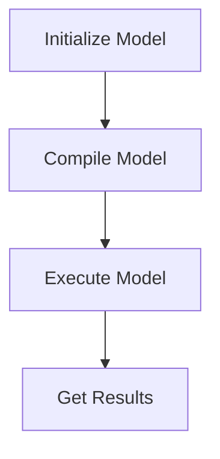

# Introduction to QEfficient
## Overview
QEfficient is a library designed to provide an interface for Hugging Face Transformer models, enabling efficient inference on Qualcomm Cloud AI 100. It serves as a dependency-managed project that relies on various libraries, including transformers, torch, and onnxruntime, located in the `QEfficient/` directory.

## Key Components / Concepts
The library includes various models such as QEffLlamaModel, QEffQwen2Model, QEffGPT2Model, and QEffGPTJModel, which are designed to work with the Hugging Face Transformer models. These models are defined in files like `QEfficient/transformers/models/modeling_auto.py` and `QEfficient/transformers/models/llama/modeling_llama.py`. It also includes configuration classes like QEffGPTQConfig for managing the model configurations, as specified in `QEfficient/transformers/quantizers/quantizer_gptq.py`.

## How it Works
QEfficient works by providing a interface for the Hugging Face Transformer models, allowing for efficient inference on Qualcomm Cloud AI 100. It uses various transforms and compilers to optimize the models for inference, as outlined in the project configuration file `pyproject.toml`.

## Example(s)
To use QEfficient, you can initialize a model using the `from_pretrained` method, compile the model for Cloud AI 100, and then execute the model. This process is facilitated by the base modeling class defined in `QEfficient/base/modeling_qeff.py`.

## Diagram(s)

Model Inference Flowchart

## References
* `QEfficient/transformers/models/modeling_auto.py`
* `QEfficient/transformers/models/llama/modeling_llama.py`
* `QEfficient/transformers/quantizers/quantizer_gptq.py`
* `pyproject.toml`