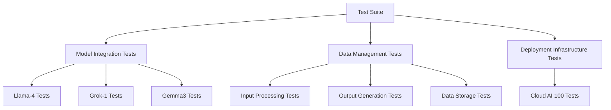

# Introduction to Tests
## Overview
The Efficient Transformers repository, located at `Efficient Transformers Wiki`, provides a comprehensive set of tests to ensure the correctness and performance of the library, covering various aspects such as model integration, data management, and deployment infrastructure, as outlined in `tests/README.md`.

## Key Components / Concepts
The tests in the repository are designed to validate the functionality of the Efficient Transformers library, focusing on key components and concepts including:
* Model integration: The tests verify that the library can integrate with different models, such as Llama-4, Grok-1, and Gemma3, as demonstrated in `tests/utils/test_hash_utils.py`.
* Data management: The tests check that the library can handle data correctly, including input processing, output generation, and data storage, as configured in `tests/conftest.py`.
* Deployment infrastructure: The tests ensure that the library can be deployed on different infrastructure, including Cloud AI 100, as described in `docs/source/release_docs.md`.

## How it Works
The tests in the repository are written using Python and utilize the PyTest framework, with test modules organized to focus on specific aspects of the library, using a combination of unit tests, integration tests, and end-to-end tests to validate the library's functionality, as shown in `tests/utils/test_hash_utils.py`.

## Example(s)
For example, the `tests/utils/test_hash_utils.py` file contains tests for the hash utility functions in the library, verifying that the functions can correctly generate hashes for different inputs, while `examples/intern_example/readme.md` provides an example of how to run inference on the InternVL-1B model using the QEFFAutoModelForCausalLM class.

## Diagram(s)

This diagram shows the organization of the tests in the repository, with the test suite at the top and the different test modules below.

## References
* `tests/README.md`: This file provides an overview of the tests in the repository and how to run them.
* `tests/conftest.py`: This file contains configuration and setup code for the tests.
* `tests/utils/test_hash_utils.py`: This file contains tests for the hash utility functions in the library.
* `docs/source/release_docs.md`: This file provides information on the latest release of the Efficient Transformers library, including new features and models.