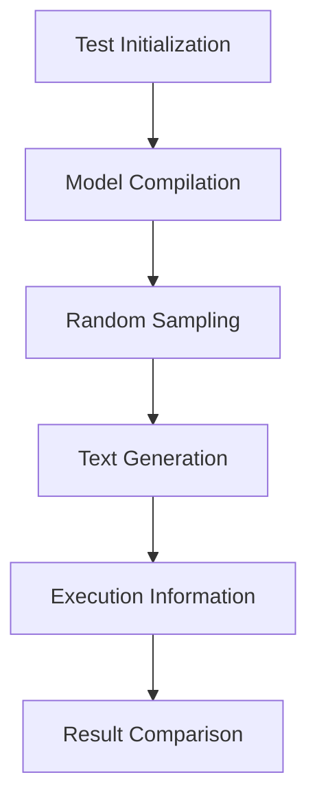

# Introduction to Tests
## Overview
The Efficient Transformers repository, located at `Efficient Transformers Wiki`, provides a comprehensive set of tests to ensure the correctness and performance of the models. These tests cover various aspects of the models, including their functionality, efficiency, and compatibility with different hardware and software configurations, as outlined in `docs/source/introduction.md`.

## Key Components / Concepts
The tests in the repository, found in `tests/`, are designed to validate the models' behavior under different scenarios, such as:
* Random sampling with QPC compiled with and without On Device Sampling
* Evaluation of the model on a given dataloader
* Generation of input files for Cloud AI 100 execution

## How it Works
The tests are implemented using Python and utilize various libraries, including PyTorch and Transformers. The tests are organized into separate files and directories, making it easy to navigate and maintain the test suite, as described in `tests/README.md`.

## Example(s)
For example, the `test_random_sampling` function in `tests/transformers/sampler/test_sampler.py` tests random sampling with QPC compiled with and without On Device Sampling. This function takes several inputs, including model name, prompts, sequence lengths, batch size, and speculative token length, and outputs generated texts and execution information.

## Diagram(s)

This flowchart illustrates the high-level process of the `test_random_sampling` function.

## References
* `tests/transformers/sampler/test_sampler.py`
* `docs/source/introduction.md`
* `tests/README.md`
* `docs/README.md`