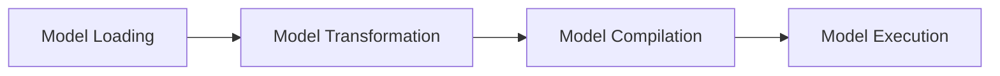

# QEfficient Core Features
## Overview
QEfficient is a library designed to optimize and accelerate transformer models for deployment on Cloud AI 100. It provides a set of core features that enable efficient model execution, including model transformation, quantization, and compilation.

## Key Components / Concepts
### Model Transformation
QEfficient provides a set of transformations that can be applied to transformer models to optimize them for Cloud AI 100. These transformations include:

*   **QEffAutoModel**: A class that provides a simple interface for loading and optimizing transformer models from the HuggingFace hub.
*   **QEFFAutoModelForCausalLM**: A class that provides a simple interface for loading and optimizing causal language models from the HuggingFace hub.
*   **QEFFAutoModelForImageTextToText**: A class that provides a simple interface for loading and optimizing multimodal language models from the HuggingFace hub.

### Quantization
QEfficient provides a set of quantization techniques that can be applied to transformer models to reduce their precision and improve their performance on Cloud AI 100. These techniques include:

*   **AWQ**: A quantization technique that uses a combination of weight and activation quantization to reduce the precision of transformer models.
*   **GPTQ**: A quantization technique that uses a combination of weight and activation quantization to reduce the precision of transformer models.

### Compilation
QEfficient provides a set of compilation techniques that can be applied to transformer models to optimize their execution on Cloud AI 100. These techniques include:

*   **Cloud AI 100 compilation**: A compilation technique that optimizes transformer models for execution on Cloud AI 100.

## How it Works
QEfficient works by applying a series of transformations to the input model, including:

1.  **Model loading**: QEfficient loads the input model from the HuggingFace hub or a local directory.
2.  **Model transformation**: QEfficient applies a series of transformations to the input model, including quantization and compilation.
3.  **Model compilation**: QEfficient compiles the transformed model for execution on Cloud AI 100.

## Example(s)
```python
from QEfficient import QEFFAutoModel

# Load a pre-trained model from the HuggingFace hub
model = QEFFAutoModel.from_pretrained("model_name")

# Apply transformations to the model
model = QEFFAutoModel.transform(model, form_factor="cloud")

# Compile the model for execution on Cloud AI 100
model.compile(num_cores=16)
```

## Diagram(s)

**Model Loading and Transformation**

## References
*   [QEfficient/transformers/models/modeling_auto.py](QEfficient/transformers/models/modeling_auto.py)
*   [QEfficient/transformers/transform.py](QEfficient/transformers/transform.py)
*   [QEfficient/transformers/quantizers/auto.py](QEfficient/transformers/quantizers/auto.py)