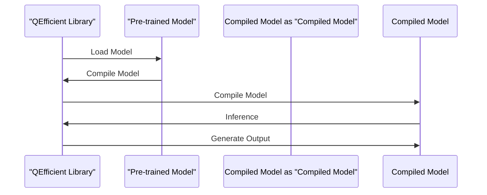

# QEfficient Model Integration
## Overview
QEfficient is a library that provides a simple and efficient way to integrate various models with the QEfficient library. The library provides a set of APIs that allow users to easily integrate their models with QEfficient, making it easy to take advantage of QEfficient's features such as model compilation, quantization, and inference.

## Key Components / Concepts
The key components and concepts in QEfficient model integration are:

*   **QEFFAutoModel**: A class that provides a simple and efficient way to integrate any transformer model from the HuggingFace hub.
*   **QEFFAutoModelForCausalLM**: A class that provides a simple and efficient way to integrate any causal language model from the HuggingFace hub.
*   **QEFFAutoModelForImageTextToText**: A class that provides a simple and efficient way to integrate any multimodal language model from the HuggingFace hub.
*   **from_pretrained**: A method that allows users to easily load pre-trained models from the HuggingFace hub.

## How it Works
The QEfficient model integration process involves the following steps:

1.  **Loading the model**: Users can load pre-trained models from the HuggingFace hub using the `from_pretrained` method.
2.  **Compiling the model**: Once the model is loaded, users can compile it for Cloud AI 100 using the `compile` method.
3.  **Inference**: After compilation, users can perform inference on the model using the `generate` method.

## Example(s)
Here is an example of how to integrate a model with QEfficient:

```python
from QEfficient import QEFFAutoModel
from transformers import AutoTokenizer

# Initialize the model using from_pretrained similar to transformers.AutoModel.
model = QEFFAutoModel.from_pretrained("model_name")

# Now you can directly compile the model for Cloud AI 100
model.compile(num_cores=16)  # Considering you have a Cloud AI 100 SKU

# Prepare input
tokenizer = AutoTokenizer.from_pretrained("model_name")
inputs = tokenizer("My name is", return_tensors="pt")

# You can now execute the model
model.generate(inputs)
```

## Diagram(s)


## References
*   `[QEfficient/transformers/models/modeling_auto.py](QEfficient/transformers/models/modeling_auto.py)`
*   `[QEfficient/transformers/models/modeling_qeff.py](QEfficient/transformers/models/modeling_qeff.py)`
*   `[QEfficient/transformers/models/modeling_auto.py](QEfficient/transformers/models/modeling_auto.py)`