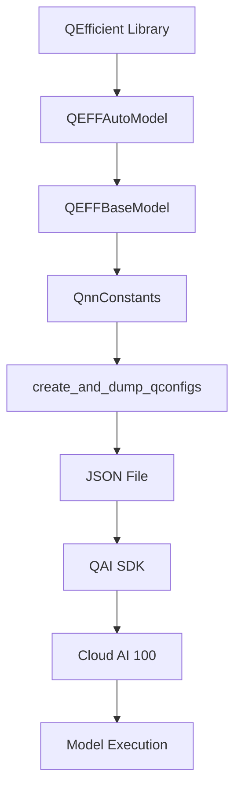

# QEfficient System Architecture
## Overview
The QEfficient library is a Python library that provides an interface for efficient inference on Qualcomm Cloud AI 100 using Hugging Face Transformer models. It is designed to work with various transformer models from the Hugging Face hub and provides a simple and easy-to-use API for compiling and running these models on the Cloud AI 100.

## Key Components / Concepts
The QEfficient library consists of several key components and concepts, including:

*   **QEFFAutoModel**: A class that provides a simple and easy-to-use API for compiling and running transformer models on the Cloud AI 100.
*   **QEFFBaseModel**: A base class for all the model classes (i.e., LLMs, SD, quantized etc.) that provides certain utility methods to be used by child classes.
*   **QnnConstants**: A class that provides a set of predefined values for various parameters, such as paths, file names, and arguments for QNN compilation tools.
*   **create_and_dump_qconfigs**: A function that creates a JSON file containing various configurations for a model, including HuggingFace configurations, QEff transforms, QAIC SDK version, QNN SDK, compilation directory, and other options.

## How it Works
The QEfficient library works by providing a simple and easy-to-use API for compiling and running transformer models on the Cloud AI 100. The library uses the Hugging Face hub to download and load the models, and then compiles and runs them on the Cloud AI 100 using the QAIC SDK.

## Example(s)
Here is an example of how to use the QEfficient library to compile and run a transformer model on the Cloud AI 100:
```python
from QEfficient import QEFFAutoModel

# Initialize the model using from_pretrained similar to transformers.AutoModel.
model = QEFFAutoModel.from_pretrained("model_name")

# Now you can directly compile the model for Cloud AI 100
model.compile(num_cores=16)  # Considering you have a Cloud AI 100 SKU

# Prepare input
tokenizer = AutoTokenizer.from_pretrained(model_name)
inputs = tokenizer("My name is", return_tensors="pt")

# You can now execute the model
model.generate(inputs)
```
## Diagram(s)

Caption: QEfficient System Architecture Diagram

## References
*   [QEfficient/transformers/models/modeling_auto.py](QEfficient/transformers/models/modeling_auto.py)
*   [QEfficient/utils/constants.py](QEfficient/utils/constants.py)
*   [QEfficient/utils/_utils.py](QEfficient/utils/_utils.py)