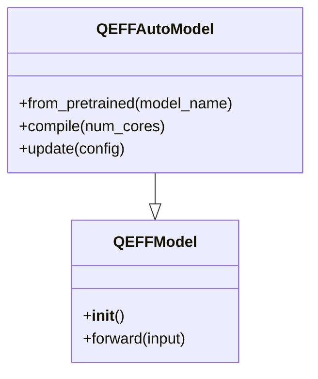

# QEfficient Extensibility and Customization
## Overview
QEfficient is designed to be highly extensible and customizable, allowing users to easily integrate new models, modify existing ones, and fine-tune the library to suit their specific needs.

## Key Components / Concepts
The key components and concepts that enable extensibility and customization in QEfficient include:

*   **Model Integration**: QEfficient supports integration with various transformer models from the HuggingFace hub, allowing users to easily add new models to the library.
*   **Customization**: Users can customize the behavior of QEfficient by modifying the configuration files, such as `qnn_config.json`, to suit their specific requirements.
*   **Fine-tuning**: QEfficient provides tools for fine-tuning the library to optimize performance on specific tasks and hardware.

## How it Works
The extensibility and customization features of QEfficient work as follows:

*   **Model Integration**: When a new model is added to the library, QEfficient automatically generates the necessary configuration files and scripts to support the model.
*   **Customization**: Users can modify the configuration files to customize the behavior of QEfficient, such as changing the model architecture, hyperparameters, or optimization settings.
*   **Fine-tuning**: QEfficient provides tools for fine-tuning the library to optimize performance on specific tasks and hardware, such as adjusting the model's architecture or hyperparameters.

## Example(s)
Here is an example of how to customize QEfficient to use a new model:

```python
from QEfficient import QEFFAutoModel

# Load the new model
model = QEFFAutoModel.from_pretrained("new_model_name")

# Customize the model configuration
model.config.update({"num_layers": 12, "hidden_size": 1024})

# Compile the model for Cloud AI 100
model.compile(num_cores=16)
```

## Diagram(s)


## References
*   [QEfficient/transformers/models/modeling_auto.py](QEfficient/transformers/models/modeling_auto.py)
*   [QEfficient/compile/qnn_compiler.py](QEfficient/compile/qnn_compiler.py)
*   [QEfficient/peft/lora/layers.py](QEfficient/peft/lora/layers.py)