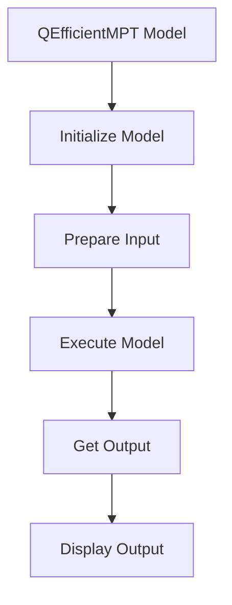

# QEfficientMPT Notebook
## Overview
The QEfficientMPT notebook demonstrates the usage of the QEfficientMPT model, which is a multimodal language model from the HuggingFace hub. This notebook shows how to initialize the model using the `from_pretrained` method and use it for inference.

## Key Components / Concepts
* QEfficientMPT model
* `from_pretrained` method
* Inference

## How it Works
The notebook uses the `from_pretrained` method to initialize the QEfficientMPT model with a pre-trained model card name from HuggingFace. The model is then used for inference on a sample input.

## Example(s)
```python
from QEfficient import QEFFAutoModelForImageTextToText
from transformers import AutoTokenizer

# Initialize the model using from_pretrained
model = QEFFAutoModelForImageTextToText.from_pretrained("meta-llama/Llama-3.2-11B-Vision-Instruct")

# Prepare input
tokenizer = AutoTokenizer.from_pretrained("meta-llama/Llama-3.2-11B-Vision-Instruct")
inputs = tokenizer("Describe this image.", return_tensors="pt")

# Execute the model
model.generate(inputs)
```

## Diagram(s)

Caption: QEfficientMPT Notebook Flowchart

## References
* `notebooks/QEfficientMPT.ipynb <https://github.com/Efficient-Transformers-Library/notebooks/QEfficientMPT.ipynb>`
* `QEfficient/transformers/models/modeling_auto.py <https://github.com/Efficient-Transformers-Library/QEfficient/transformers/models/modeling_auto.py>`
* `QEfficient/transformers/models/mpt/modeling_mpt.py <https://github.com/Efficient-Transformers-Library/QEfficient/transformers/models/mpt/modeling_mpt.py>`