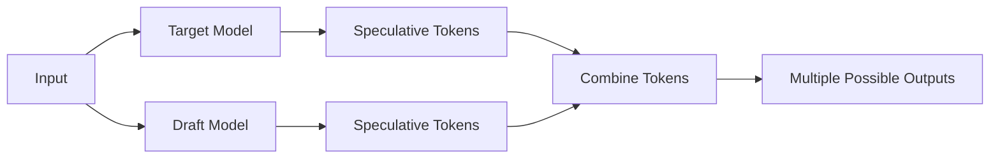

# Speculative Decoding
## Overview
Speculative Decoding is a feature in the Efficient Transformers Library that allows the model to generate multiple possible outputs for a given input. This feature is useful for applications where multiple possible outputs are desired, such as in text summarization or machine translation.

## Key Components / Concepts
The key components and concepts involved in Speculative Decoding are:

*   **Speculative Tokens**: These are the tokens that the model generates as possible outputs for a given input.
*   **Target Model**: This is the model that is used to generate the speculative tokens.
*   **Draft Model**: This is a smaller model that is used to generate the speculative tokens for the target model.
*   **Speculative Decoding**: This is the process of generating multiple possible outputs for a given input using the target and draft models.

## How it Works
The Speculative Decoding process works as follows:

1.  The user provides an input to the model.
2.  The model generates speculative tokens for the input using the target model.
3.  The model generates speculative tokens for the input using the draft model.
4.  The model combines the speculative tokens from the target and draft models to generate multiple possible outputs for the input.

## Example(s)
The following example shows how to use the `pld_spec_decode_inference` function to perform speculative decoding on a given input:

```python
from QEfficient.transformers.models import SpDTransform

# Create a target model
target_model = SpDTransform(model=QEffLlamaForCausalLM())

# Create a draft model
draft_model = SpDTransform(model=QEffQwen2ForCausalLM())

# Perform speculative decoding
speculative_tokens = pld_spec_decode_inference(
    prompts=["This is a sample prompt"],
    num_speculative_tokens=10,
    prefill_seq_len=10,
    ctx_len=10,
    prefill_bsz=10,
    target_model_name="target_model",
    full_batch_size=10,
    device_group=[0, 1, 2, 3],
    max_ngram_size=10,
)

# Print the speculative tokens
print(speculative_tokens)
```

## Diagram(s)

Caption: Speculative Decoding Process

## References
*   [docs/source/finetune.md](docs/source/finetune.md)
*   [docs/source/quick_start.md](docs/source/quick_start.md)
*   [QEfficient/transformers/models/pytorch_transforms.py](QEfficient/transformers/models/pytorch_transforms.py)