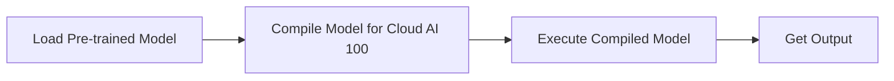

# Quick Start
## Overview
The Efficient Transformers Library is a Python library designed to optimize and deploy transformer models on Cloud AI 100. It provides a simple and efficient way to load, compile, and execute transformer models on the Cloud AI 100 platform.

## Key Components / Concepts
The library consists of the following key components:

*   `QEFFAutoModel`: A class that serves as the entry point for loading and compiling transformer models.
*   `from_pretrained`: A method that loads a pre-trained model from the HuggingFace model hub.
*   `transform`: A function that optimizes a model for Cloud AI 100 by replacing its layers with optimized implementations.

## How it Works
Here's a high-level overview of the workflow:

1.  Load a pre-trained model using `from_pretrained`.
2.  Compile the model for Cloud AI 100 using the `compile` method.
3.  Execute the compiled model using the `generate` method.

## Example(s)
```python
from QEfficient import QEFFAutoModel
from transformers import AutoTokenizer

# Load a pre-trained model
model = QEFFAutoModel.from_pretrained("model_name")

# Compile the model for Cloud AI 100
model.compile(num_cores=16)

# Prepare input
tokenizer = AutoTokenizer.from_pretrained("model_name")
inputs = tokenizer("My name is", return_tensors="pt")

# Execute the model
model.generate(inputs)
```

## Diagram(s)

Caption: High-level workflow of the Efficient Transformers Library.

## References
*   [QEfficient/transformers/models/modeling_auto.py](https://github.com/your-repo/QEfficient/blob/main/transformers/models/modeling_auto.py)
*   [QEfficient/transformers/transform.py](https://github.com/your-repo/QEfficient/blob/main/transformers/transform.py)
*   [QEfficient/transformers/quantizers/auto.py](https://github.com/your-repo/QEfficient/blob/main/transformers/quantizers/auto.py)