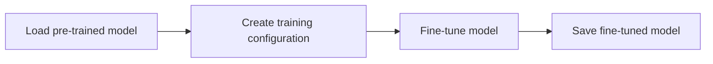

# Finetuning
## Overview
Finetuning is the process of fine-tuning a pre-trained model on a specific task or dataset. In the context of the Efficient Transformers Library, finetuning is used to adapt a pre-trained model to a specific use case or task.

## Key Components / Concepts
The key components involved in finetuning are:

*   **Pre-trained model**: A pre-trained model is a model that has been trained on a large dataset and has learned general features and patterns. In the Efficient Transformers Library, pre-trained models are loaded from the Hugging Face model hub.
*   **Fine-tuning**: Fine-tuning is the process of adapting a pre-trained model to a specific task or dataset. This involves updating the model's weights and biases to better fit the new task or dataset.
*   **Training configuration**: The training configuration specifies the hyperparameters and settings for the fine-tuning process, such as the learning rate, batch size, and number of epochs.

## How it Works
The finetuning process in the Efficient Transformers Library involves the following steps:

1.  **Loading the pre-trained model**: The pre-trained model is loaded from the Hugging Face model hub using the `from_pretrained` method.
2.  **Creating a training configuration**: A training configuration is created using the `TrainConfig` class, which specifies the hyperparameters and settings for the fine-tuning process.
3.  **Fine-tuning the model**: The pre-trained model is fine-tuned on the specified task or dataset using the `apply_peft` function, which applies the Parameter-Efficient Fine-Tuning (PEFT) algorithm to the model.
4.  **Saving the fine-tuned model**: The fine-tuned model is saved to a file using the `save_pretrained` method.

## Example(s)
Here is an example of how to fine-tune a pre-trained model using the Efficient Transformers Library:
```python
from QEfficient.cloud.finetune import main

# Create a training configuration
train_config = TrainConfig()

# Update the training configuration with custom settings
train_config.update_config({"learning_rate": 5e-4, "batch_size": 32})

# Fine-tune the model
main(train_config=train_config)
```
## Diagram(s)

**Fine-tuning workflow**

## References
*   [QEfficient/cloud/finetune.py](QEfficient/cloud/finetune.py)
*   [QEfficient/transformers/models/modeling_auto.py](QEfficient/transformers/models/modeling_auto.py)
*   [QEfficient/finetune/utils/parser.py](QEfficient/finetune/utils/parser.py)