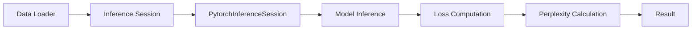

# Perplexity Computation
## Overview
The perplexity computation script is a crucial component of the Efficient Transformers Library, responsible for calculating the perplexity of a given model. Perplexity is a measure of how well a model predicts the next token in a sequence, with lower perplexity indicating better performance.

## Key Components / Concepts
The perplexity computation script utilizes the following key components and concepts:

*   `calculate_perplexity` function: This function calculates the perplexity of a given model by iterating over the test data, computing the loss for each batch, and then calculating the average loss.
*   `torch_perplexity` function: This function is a helper function used by `calculate_perplexity` to compute the loss for each batch.
*   `PytorchInferenceSession` class: This class is used to run the model inference and compute the loss.

## How it Works
The perplexity computation script works as follows:

1.  The `calculate_perplexity` function is called with the required parameters, including the data loader, inference session, context length, prompt length, model type, batch size, log file, and model name.
2.  The `torch_perplexity` function is called to compute the loss for each batch in the test data.
3.  The average loss is calculated and used to compute the perplexity.
4.  The perplexity is returned as the result.

## Example(s)
To use the perplexity computation script, you can call the `calculate_perplexity` function with the required parameters. For example:

```python
from scripts.perplexity_computation.calculate_perplexity import calculate_perplexity

data_loader = ...  # load the test data
inference_session = ...  # create an inference session
ctx_len = 2048
prompt_len = 1
model_type = "torch"
batch_size = 1
log_file = "perplexity.log"
model_name = "model_name"

perplexity, avg_loss = calculate_perplexity(data_loader, inference_session, ctx_len, prompt_len, model_type, batch_size, log_file, model_name)
print(perplexity)
```

## Diagram(s)

Caption: Perplexity Computation Flowchart

## References
*   [scripts/perplexity_computation/calculate_perplexity.py](scripts/perplexity_computation/calculate_perplexity.py)
*   [scripts/perplexity_computation/__init__.py](scripts/perplexity_computation/__init__.py)
*   [QEfficient/utils/_utils.py](QEfficient/utils/_utils.py)