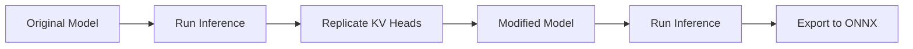

# Replicate KV Heads
## Overview
Replicating KV heads is a crucial step in optimizing models for Cloud AI 100. The `replicate_kv_heads` script performs the following steps:
1. Runs inference with the original model.
2. Replicates the KV heads.
3. Runs inference on the modified model to validate the changes.
4. Exports the modified model to ONNX format.

## Key Components / Concepts
- **KV Heads**: Key-Value (KV) heads are a type of attention mechanism used in transformer models. They are particularly useful for auto-regressive tasks, where sequence generation involves processing one token at a time.
- **Cloud AI 100**: Cloud AI 100 is a hardware platform designed for efficient model inference. It uses a unique architecture that splits the model into two parts: image encoding and output generation.

## How it Works
The `replicate_kv_heads` script uses the following steps to replicate KV heads:
1. It runs inference with the original model to get the input data.
2. It replicates the KV heads by creating a new model with the same architecture as the original model, but with the KV heads replaced.
3. It runs inference on the modified model to validate the changes.
4. It exports the modified model to ONNX format.

## Example(s)
```python
from scripts.replicate_kv_head.replicate_kv_heads import replicate_kv_heads

# Replicate KV heads for the Meta-Llama 3-8B-Instruct model
replicate_kv_heads(model_name="meta-llama/Meta-Llama-3-8B-Instruct", prompt="My name is", repeat=2)
```

## Diagram(s)

Caption: Replicating KV Heads

## References
- `scripts/replicate_kv_head/replicate_kv_heads.py`: The script that replicates KV heads.
- `scripts/replicate_kv_head/__init__.py`: The initialization file for the replicate KV heads script.
- `QEfficient/transformers/transform.py`: The file that contains the `transform` function, which is used to optimize models for Cloud AI 100.