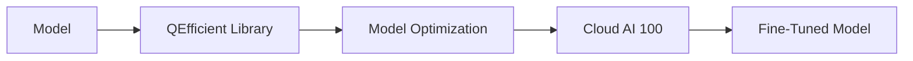

# Finetune Model
## Overview
The `finetune` script is used to fine-tune a given model. It takes in a model name, token, query, image URL, and other optional parameters to perform fine-tuning.

## Key Components / Concepts
* `finetune` script
* Model fine-tuning
* QEfficient library

## How it Works
The `finetune` script uses the QEfficient library to fine-tune a given model. It takes in a model name, token, query, image URL, and other optional parameters to perform fine-tuning. The script uses the `transform` function from the QEfficient library to optimize the model for Cloud AI 100.

## Example(s)
```python
from QEfficient.cloud.finetune import main

main(
    model_name="meta-llama/Llama-3.2-1B",
    lr=5e-4,
    peft_config_file="lora_config.yaml"
)
```

## Diagram(s)

**Model Optimization Flowchart**

## References
* `QEfficient/cloud/finetune.py`: The `finetune` script.
* `QEfficient/transformers/models/modeling_auto.py`: The `transform` function used for model optimization.
* `QEfficient/cloud/infer.py`: The `execute_vlm_model` function used for model execution.