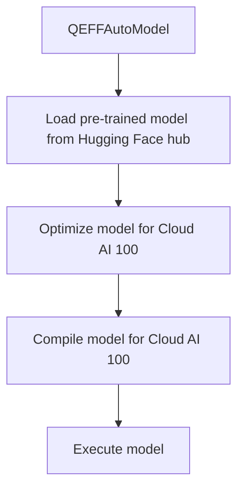

# Model Support
## Overview
The Efficient Transformers Library supports a wide range of models, including those from the Hugging Face hub. The library provides a simple and consistent interface for loading, optimizing, and deploying these models on Cloud AI 100.

## Key Components / Concepts
The key components and concepts in the Efficient Transformers Library's model support include:

*   **QEFFAutoModel**: A class for manipulating any transformer model from the Hugging Face hub.
*   **QEFFAutoModelForCausalLM**: A class for manipulating any causal language model from the Hugging Face hub.
*   **QEFFAutoModelForImageTextToText**: A class for working with multimodal language models from the Hugging Face hub.
*   **transform**: A function for optimizing any kind of model (i.e. LLM, SD, AWQ etc.) for Cloud AI 100.
*   **from_pretrained**: A method for loading pre-trained models from the Hugging Face hub.

## How it Works
The Efficient Transformers Library's model support works by providing a simple and consistent interface for loading, optimizing, and deploying models on Cloud AI 100. The library uses the Hugging Face hub as a source of pre-trained models, and provides a range of tools and functions for manipulating and optimizing these models.

## Example(s)
Here is an example of how to use the `QEFFAutoModel` class to load a pre-trained model from the Hugging Face hub:
```python
from QEfficient import QEFFAutoModel
from transformers import AutoTokenizer

# Initialize the model using from_pretrained similar to transformers.AutoModel.
model = QEFFAutoModel.from_pretrained("model_name")

# Now you can directly compile the model for Cloud AI 100
model.compile(num_cores=16)  # Considering you have a Cloud AI 100 SKU

# Prepare input
tokenizer = AutoTokenizer.from_pretrained("model_name")
inputs = tokenizer("My name is", return_tensors="pt")

# You can now execute the model
model.generate(inputs)
```

## Diagram(s)

Caption: Model Support Flowchart

## References
*   `[QEfficient/transformers/models/modeling_auto.py](https://github.com/your-repo/QEfficient/blob/main/transformers/models/modeling_auto.py)`
*   `[QEfficient/transformers/transform.py](https://github.com/your-repo/QEfficient/blob/main/transformers/transform.py)`
*   `[QEfficient/transformers/models/modeling_auto.py](https://github.com/your-repo/QEfficient/blob/main/transformers/models/modeling_auto.py)`