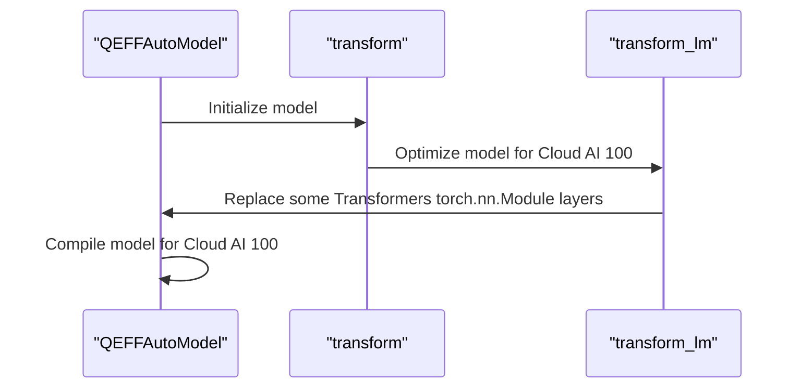

# Server and API
## Overview
The Efficient Transformers library provides a server and API for efficient inference and compilation of various transformer models. The library supports features such as sentence embedding, flexible pooling configuration, and support for multiple sequence lengths.

## Key Components / Concepts
The key components of the Efficient Transformers library include:

*   `QEFFAutoModel`: A class for manipulating any transformer model from the HuggingFace hub.
*   `transform`: A function for optimizing any kind of model (i.e. LLM, SD, AWQ etc.) for Cloud AI 100.
*   `transform_lm`: A function for replacing some Transformers torch.nn.Module layers for equivalent optimized modules for Cloud AI 100.

## How it Works
The Efficient Transformers library works by using the `QEFFAutoModel` class to manipulate the transformer model, and the `transform` function to optimize the model for Cloud AI 100. The `transform_lm` function is used to replace some Transformers torch.nn.Module layers for equivalent optimized modules for Cloud AI 100.

## Example(s)
```python
from QEfficient import QEFFAutoModel
from transformers import AutoTokenizer

# Initialize the model using from_pretrained similar to transformers.AutoModel.
model = QEFFAutoModel.from_pretrained("model_name")

# Now you can directly compile the model for Cloud AI 100
model.compile(num_cores=16)  # Considering you have a Cloud AI 100 SKU

# Prepare input
tokenizer = AutoTokenizer.from_pretrained(model_name)
inputs = tokenizer("My name is", return_tensors="pt")

# You can now execute the model
model.generate(inputs)
```

## Diagram(s)

Caption: Sequence diagram of the Efficient Transformers library workflow.

## References
*   [QEfficient/transformers/transform.py](QEfficient/transformers/transform.py)
*   [QEfficient/transformers/models/modeling_auto.py](QEfficient/transformers/models/modeling_auto.py)
*   [QEfficient/transformers/quantizers/auto.py](QEfficient/transformers/quantizers/auto.py)