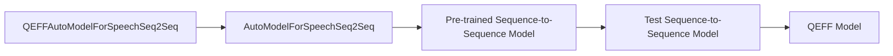

# Testing Speech Sequence-to-Sequence Models
## Overview
The Efficient Transformers Library provides a range of features for testing speech sequence-to-sequence models. These models are designed for speech-to-text tasks and can be tested using various functions and classes.

## Key Components / Concepts
The key components and concepts involved in testing speech sequence-to-sequence models include:

*   `QEFFAutoModelForSpeechSeq2Seq`: a class for creating a QEFF model from a pre-trained sequence-to-sequence model.
*   `AutoModelForSpeechSeq2Seq`: a class for creating a pre-trained sequence-to-sequence model.
*   `test_seq2seq_pretrained`: a function for testing a pre-trained sequence-to-sequence model.
*   `test_seq2seq_pytorch_vs_kv_vs_ort_vs_ai100`: a function for testing and validating four different models: PyTorch, PyTorch with KV changes, ONNX, and Cloud AI 100, for sequence-to-sequence tasks.

## How it Works
The testing process involves creating a QEFF model from a pre-trained sequence-to-sequence model using the `QEFFAutoModelForSpeechSeq2Seq` class. The `test_seq2seq_pretrained` function is then used to test the pre-trained model. This function saves the pre-trained model to a temporary path and loads it back to check if it is an instance of the QEFF model.

## Example(s)
Here is an example of how to test a pre-trained sequence-to-sequence model using the `test_seq2seq_pretrained` function:
```python
from QEfficient import QEFFAutoModelForSpeechSeq2Seq
from transformers import AutoModelForSpeechSeq2Seq

config = AutoModelForSpeechSeq2Seq.from_config(AutoConfig.for_model("speech_to_text"))
tmp_path = "/tmp/model"
test_seq2seq_pretrained(config, tmp_path)
```
## Diagram(s)

Caption: Testing a pre-trained sequence-to-sequence model using the `QEFFAutoModelForSpeechSeq2Seq` class.

## References
*   `tests/transformers/test_speech_seq2seq.py`: This file contains the `test_seq2seq_pretrained` function.
*   `tests/transformers/models/test_speech_seq2seq_models.py`: This file contains the `test_seq2seq_pytorch_vs_kv_vs_ort_vs_ai100` function.
*   `QEfficient/transformers/models/modeling_auto.py`: This file contains the `QEFFAutoModelForSpeechSeq2Seq` class.