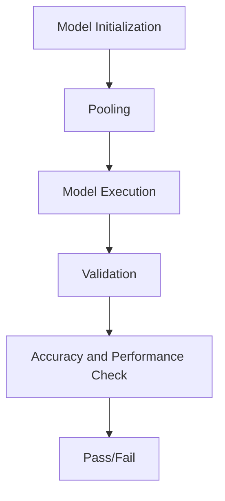

# Testing Embedding Models
## Overview
The Efficient Transformers Library provides a range of tools and functions for testing and validating embedding models. These models are a crucial component of many natural language processing (NLP) tasks, and ensuring their accuracy and performance is essential for reliable results.

## Key Components / Concepts
The key components and concepts involved in testing embedding models include:

*   Embedding layers: These are the layers responsible for converting input tokens into dense vector representations.
*   Pooling methods: These are used to aggregate the output of the embedding layer, such as mean, max, or CLS token pooling.
*   Model runtimes: These are the different environments in which the model can be executed, such as PyTorch, ONNX, and AI 100.

## How it Works
The testing process for embedding models involves the following steps:

1.  **Model Initialization**: The model is initialized using the `from_pretrained` method, which loads the pre-trained model weights and configuration.
2.  **Pooling**: The pooling method is applied to the output of the embedding layer to aggregate the vector representations.
3.  **Model Execution**: The model is executed in the chosen runtime environment, such as PyTorch, ONNX, or AI 100.
4.  **Validation**: The output of the model is validated against a reference output to ensure accuracy and performance.

## Example(s)
The following example demonstrates how to test an embedding model using the `test_embed_model_pytorch_vs_onnx_vs_ai100` function:

```python
from QEfficient import QEFFAutoModel
from transformers import AutoTokenizer

# Initialize the model using from_pretrained
model = QEFFAutoModel.from_pretrained("gpt2")

# Test the model in PyTorch, ONNX, and AI 100 runtimes
test_embed_model_pytorch_vs_onnx_vs_ai100(model)
```

## Diagram(s)

Caption: Testing Embedding Models Flowchart

## References
*   `tests/transformers/models/test_embedding_models.py`: This file contains the `test_embed_model_pytorch_vs_onnx_vs_ai100` function, which tests the output of PyTorch, ONNX, and AI 100 runtime models.
*   `QEfficient/transformers/embeddings/embedding_utils.py`: This file contains the `PooledModel` class, which adds pooling functionality to embedding models.
*   `QEfficient/transformers/models/modeling_auto.py`: This file contains the `QEFFAutoModel` class, which is used to manipulate transformer models from the Hugging Face hub.