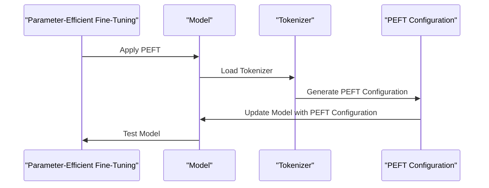

# Testing PEFT Models
## Overview
The Efficient Transformers Library (Efficient) provides a range of tools for testing PEFT (Parameter-Efficient Fine-Tuning) models. These tests ensure that the PEFT models are functioning correctly and efficiently.

## Key Components / Concepts
The key components and concepts involved in testing PEFT models include:

*   `apply_peft`: A function that applies PEFT to a model if enabled.
*   `generate_peft_config`: A function that generates a PEFT-compatible configuration from a custom config based on the `peft_method`.
*   `load_model_and_tokenizer`: A function that loads the pre-trained model and tokenizer from Hugging Face.

## How it Works
The testing process for PEFT models involves the following steps:

1.  **Loading the model and tokenizer**: The `load_model_and_tokenizer` function is used to load the pre-trained model and tokenizer from Hugging Face.
2.  **Generating the PEFT configuration**: The `generate_peft_config` function is used to generate a PEFT-compatible configuration based on the `peft_method`.
3.  **Applying PEFT**: The `apply_peft` function is used to apply PEFT to the model if enabled.
4.  **Testing the model**: The model is then tested using various test cases to ensure that it is functioning correctly and efficiently.

## Example(s)
Here is an example of how to test a PEFT model using the `test_auto_peft_model_for_causal_lm_export` function from the `tests/peft/test_peft_model.py` file:

```python
def test_auto_peft_model_for_causal_lm_export(base_config, adapter_config, tmp_path):
    # Create a PEFT model
    lora_model = create_peft_model(base_config, adapter_config)
    qeff_model = QEffAutoPeftModelForCausalLM(lora_model)

    # Export the model
    qeff_model.export(tmp_path)

    # Check if the export was successful
    assert qeff_model.onnx_path.is_file()
```

## Diagram(s)


## References
*   `tests/peft/test_peft_model.py`
*   `tests/peft/test_peft_onnx_transforms.py`
*   `QEfficient/cloud/finetune.py`