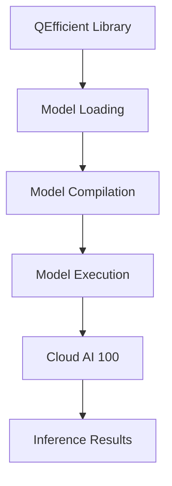

# QEfficient Deployment/Infrastructure
## Overview
QEfficient is a library designed for efficient inference on Qualcomm Cloud AI 100 using Hugging Face Transformer models. It provides a simple and easy-to-use interface for deploying and managing models on the Cloud AI 100.

## Key Components / Concepts
QEfficient consists of several key components and concepts, including:

*   **QEFFAutoModel**: A class designed for manipulating any transformer model from the Hugging Face hub.
*   **QEFFAutoModelForCausalLM**: A class designed for manipulating any causal language model from the Hugging Face hub.
*   **CloudAI100ExecInfo**: A class that holds all the information about Cloud AI 100 execution.
*   **qualcomm_efficient_converter**: A function that is an alias for `QEfficient.export`.
*   **transform**: A function that serves for optimizing any kind of model (i.e. LLM, SD, AWQ etc.) for Cloud AI 100.

## How it Works
QEfficient works by providing a simple and easy-to-use interface for deploying and managing models on the Cloud AI 100. The library uses the Hugging Face Transformer models and provides a range of features, including:

*   **Model loading**: QEfficient can load models from the Hugging Face hub or from a local directory.
*   **Model compilation**: QEfficient can compile models for Cloud AI 100, which enables efficient inference on the device.
*   **Model execution**: QEfficient can execute models on the Cloud AI 100, which enables fast and efficient inference.

## Example(s)
Here is an example of how to use QEfficient to deploy a model on the Cloud AI 100:
```python
from QEfficient import QEFFAutoModel

# Load the model from the Hugging Face hub
model = QEFFAutoModel.from_pretrained("gpt2")

# Compile the model for Cloud AI 100
model.compile(num_cores=16)

# Execute the model on the Cloud AI 100
model.generate("My name is")
```
## Diagram(s)

Caption: QEfficient Deployment Flow

## References
*   `[QEfficient/cloud/export.py](QEfficient/cloud/export.py)`
*   `[QEfficient/cloud/finetune.py](QEfficient/cloud/finetune.py)`
*   `[QEfficient/cloud/infer.py](QEfficient/cloud/infer.py)`