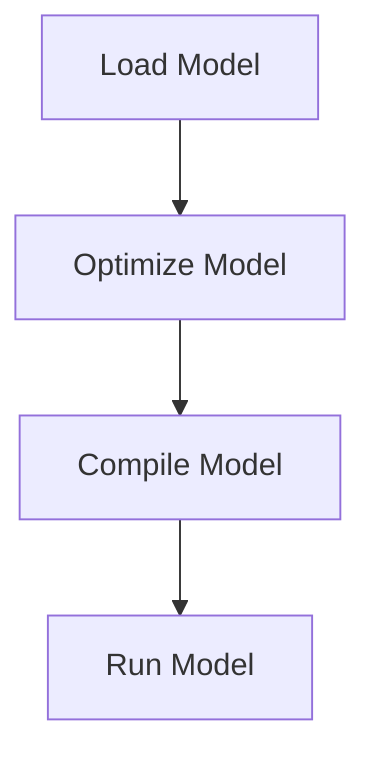

# Model Integration
## Overview
The Efficient Transformers Library provides a simple and efficient way to integrate transformer models into your application. The library offers a range of features and tools to help you get started with model integration, including the `from_pretrained` method, which allows you to easily load and initialize a model from the Hugging Face hub.

## Key Components / Concepts
The key components and concepts involved in model integration with the Efficient Transformers Library include:

*   `QEFFAutoModel`: A class that provides a simple interface for loading and manipulating transformer models from the Hugging Face hub.
*   `from_pretrained`: A method that allows you to load and initialize a model from the Hugging Face hub.
*   `transform`: A function that optimizes a model for Cloud AI 100 by replacing torch.nn.Module layers with optimized implementations.

## How it Works
To integrate a transformer model into your application using the Efficient Transformers Library, follow these steps:

1.  Load the model using the `from_pretrained` method, passing in the model name or path to the model directory.
2.  Use the `transform` function to optimize the model for Cloud AI 100.
3.  Compile the model using the `compile` method, passing in the required parameters such as the number of cores and device group.

## Example(s)
Here is an example of how to integrate a transformer model into your application using the Efficient Transformers Library:

```python
from QEfficient import QEFFAutoModel
from transformers import AutoTokenizer

# Load the model using from_pretrained
model = QEFFAutoModel.from_pretrained("model_name")

# Optimize the model for Cloud AI 100
model = QEFFAutoModel.transform(model, "cloud")

# Compile the model
model.compile(num_cores=16, device_group=[0])
```

## Diagram(s)

Caption: Model Integration Flow

## References
*   `[QEfficient/transformers/models/modeling_auto.py](https://github.com/your-repo/QEfficient/blob/master/transformers/models/modeling_auto.py)`
*   `[QEfficient/transformers/transform.py](https://github.com/your-repo/QEfficient/blob/master/transformers/transform.py)`
*   `[QEfficient/transformers/models/pytorch_transforms.py](https://github.com/your-repo/QEfficient/blob/master/transformers/models/pytorch_transforms.py)`