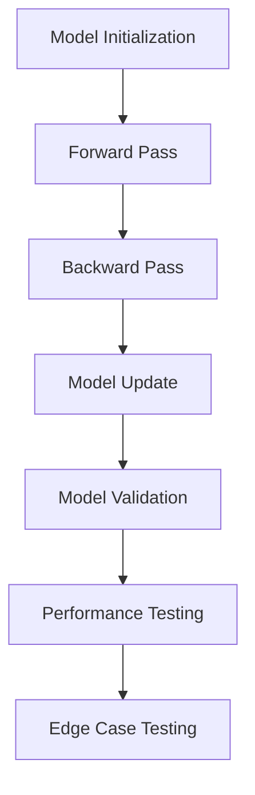

# Testing Causal Language Models
## Overview
Testing causal language models is a crucial aspect of ensuring the quality and reliability of these models. The Efficient Transformers Library provides a range of testing functions to validate the performance and behavior of causal language models.

## Key Components / Concepts
The key components and concepts involved in testing causal language models include:

*   **Model validation**: Verifying that the model's architecture and behavior match the expected specifications.
*   **Performance testing**: Evaluating the model's performance on various tasks, such as language translation, text generation, and sentiment analysis.
*   **Edge case testing**: Testing the model's behavior on edge cases, such as out-of-vocabulary words, long input sequences, and model overflow.

## How it Works
The testing functions in the Efficient Transformers Library use a combination of unit tests and integration tests to validate the causal language models. The tests cover various aspects of the models, including:

*   **Model initialization**: Verifying that the model is initialized correctly and has the expected architecture.
*   **Forward pass**: Testing the model's forward pass, including the input processing, model computation, and output generation.
*   **Backward pass**: Verifying the model's backward pass, including the computation of gradients and the update of model parameters.

## Example(s)
Here are some examples of testing functions in the Efficient Transformers Library:

```python
# Test function to validate the PyTorch model, the PyTorch model after KV changes, the ONNX model, and the Cloud AI 100 model, both with and without continuous batching.
def test_causal_lm_pytorch_vs_kv_vs_ort_vs_ai100(model_name):
    n_layer = get_custom_n_layers(model_name)
    check_causal_lm_pytorch_vs_kv_vs_ort_vs_ai100(model_name=model_name, n_layer=n_layer)

# Test function to validate the dummy PyTorch model, the PyTorch model after KV changes, the ONNX model, and the Cloud AI 100 model, both with and without continuous batching.
def test_custom_causal_lm_pytorch_vs_kv_vs_ort_vs_ai100(model_name, custom_causal_model_config_dict):
    config = custom_causal_model_config_dict.get(model_name)
    qnn_config_json_path = os.path.join(os.getcwd(), "qnn_config.json")
    create_json(qnn_config_json_path, QnnConstants.QNN_SAMPLE_CONFIG)
    check_causal_lm_pytorch_vs_kv_vs_ort_vs_ai100(model_name, enable_qnn=True, qnn_config=qnn_config_json_path, config=config)
```

## Diagram(s)

Caption: Testing Causal Language Models Workflow

## References
*   `[tests/transformers/models/test_causal_lm_models.py](tests/transformers/models/test_causal_lm_models.py)`
*   `[tests/transformers/test_causal_lm.py](tests/transformers/test_causal_lm.py)`
*   `[QEfficient/utils/_utils.py](QEfficient/utils/_utils.py)`